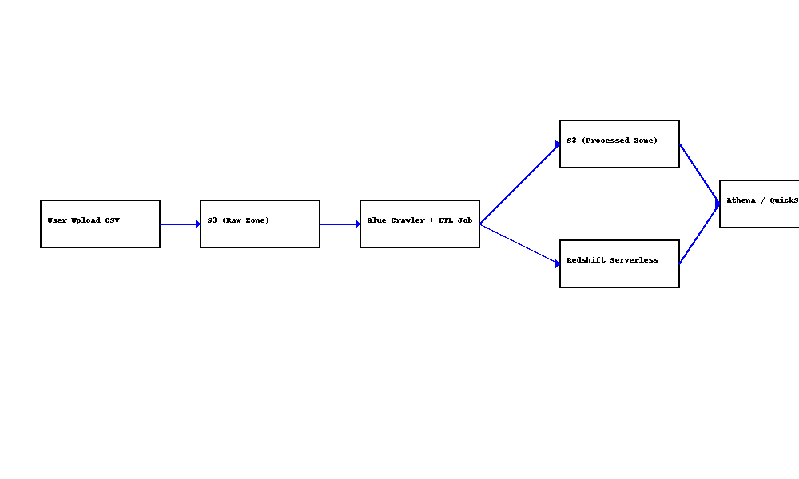

# aws-sales-insight-pipeline
End-to-end serverless data engineering pipeline on AWS using Glue, Redshift, Athena, and S3 — deployed with Terraform.

# 🛍️ Sales Insight Platform – AWS Data Pipeline

This project demonstrates a fully serverless data engineering pipeline using AWS services to build an end-to-end retail analytics platform.

## 📌 Features
- Fully automated infrastructure via Terraform
- Raw and processed data zones in S3
- ETL with AWS Glue (Crawlers + Spark Jobs)
- Querying with Athena and Redshift Serverless
- Optional visualizations via QuickSight

## 🗺 Architecture Diagram


## 🔧 Technologies Used
- AWS S3
- AWS Glue (Crawlers, Jobs, Catalog)
- AWS Athena
- AWS Redshift Serverless
- AWS IAM
- AWS QuickSight (Optional)
- Terraform (modularized)

## 🛠 Folder Structure
```
aws-sales-insight-pipeline/
├── terraform/
│   ├── main.tf
│   ├── variables.tf
│   ├── outputs.tf
│   ├── glue.tf
│   ├── redshift.tf
│   ├── athena.tf
│   ├── s3.tf
│   └── iam.tf
├── glue-scripts/
│   └── transform_orders.py
├── screenshots/
│   └── athena-query-result.png
├── architecture.png
├── README.md
```

## 🚀 How to Deploy
```bash
cd terraform
terraform init
terraform plan
terraform apply
```

## 🧪 Sample Athena Query
```sql
SELECT customer_id, SUM(order_value) AS total_spent
FROM orders_cleaned
GROUP BY customer_id
ORDER BY total_spent DESC;
```

## 📈 Metrics You Can Visualize
- Monthly revenue
- Top-selling products
- Repeat vs new customers
- Country-wise sales breakdown

## 📚 Author
**Aravindh Kumar M**  
[LinkedIn](https://www.linkedin.com/in/aravindhkumar-m1997)
